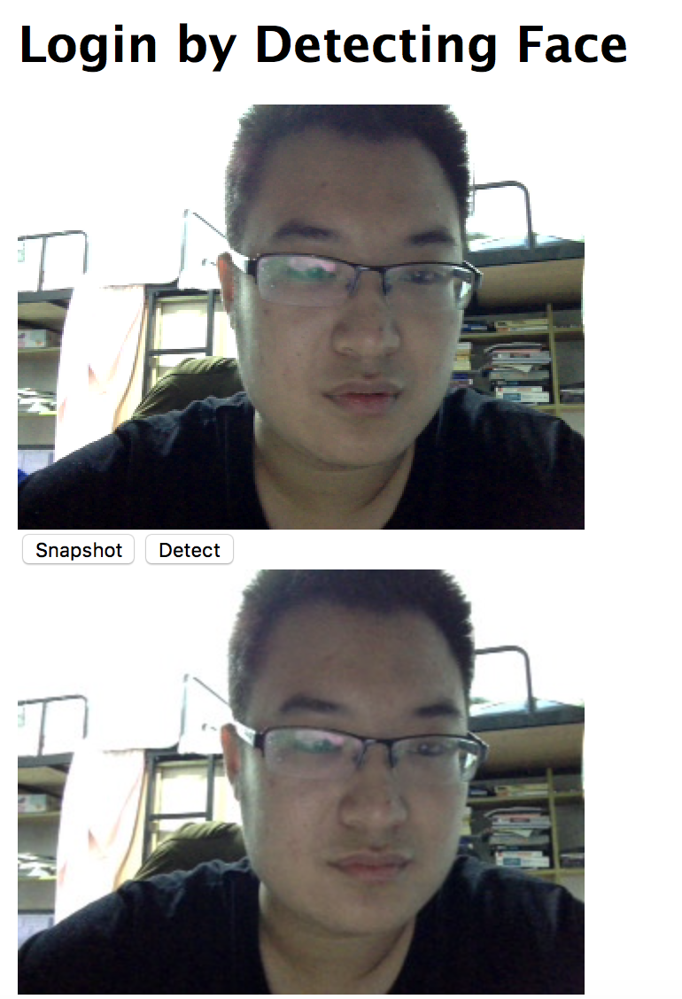

#二手车估价作业文档
##功能及截图
###人脸识别
####登录功能
人脸识别功能通过在网页上开启摄像头，选择合适的位置照相。这里使用了历史悠久、兼容性好的flash库进行显示。

点击detect后会使用微软的API进行人脸识别。

将会有弹出窗告知识别结果，如果没能发现人脸需要重新识别，如果发现并且从注册用户中找到比较像的人脸后会自动登录。，并分配session_id，同时前端显示进入车辆识别页面的超链接。
####注册功能
注册界面与登录类似，只是需要注册的用户名和人脸。

### 二手车估价
首先，页面会有一行显示当前登录用户名。
利用微软云平台上训练好的API进行识别，这里只要求输入作为Feature的那些列的数据。


点击predict按键后会出现等待字样，等查询结束会返回预测价格。
##可访问网站及url
[http://expert.eastasia.cloudapp.azure.com](http://expert.eastasia.cloudapp.azure.com)
##开发运行环境
```
node.js v6.2.0
express ~4.13.4

运行development代码需要先 npm install
之后 npm start
就可以在3000端口访问网站
```
##开发编程语言
Javascript
